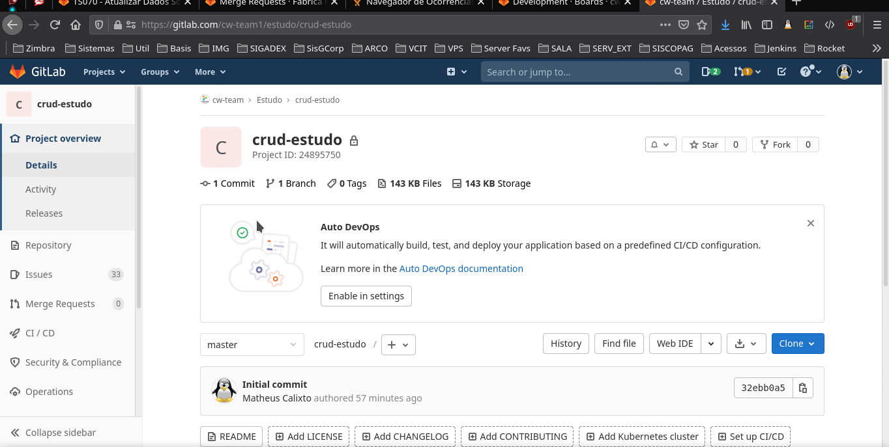
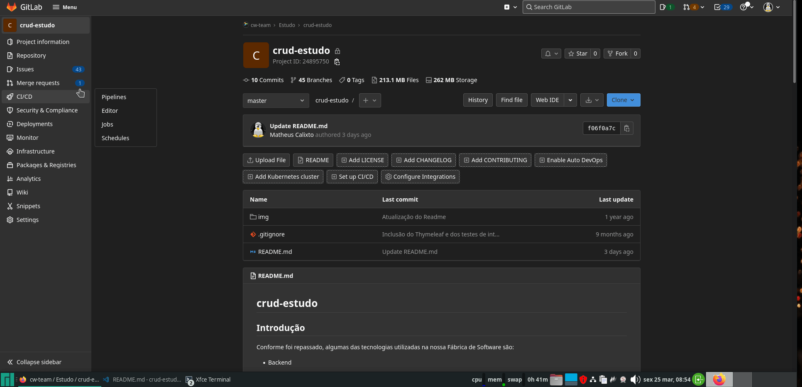

# crud-estudo

## Introdução

Conforme foi repassado, algumas das tecnologias utilizadas na nossa Fábrica de Software são:

- Back-end
   - Linguagem Java
   - Framework Spring Boot [Link de Apoio](https://www.algaworks.com/meus-cursos/angular-rest-spring-boot) [Link de Apoio 2](https://www.youtube.com/watch?v=bCzsSXE4Jzg&list=PL62G310vn6nFBIxp6ZwGnm8xMcGE3VA5H)
   - Bancos de dados Relacionais
   - Liquibase [Link de Apoio](https://docs.liquibase.com/change-types/community/home.html)
   - Thymeleaf [Link de Apoio 1](https://www.baeldung.com/java-pdf-creation) [Link de Apoio 2](https://kb.itextpdf.com/home/it7kb/ebooks/itext-7-converting-html-to-pdf-with-pdfhtml/chapter-1-hello-html-to-pdf)
   - Apache POI [Link de Apoio](https://www.baeldung.com/java-microsoft-excel)

- Frontend
   - Angular (versão mais recente) [Link de Apoio 1](https://www.algaworks.com/meus-cursos/angular-rest-spring-boot), [Link de Apoio 2](https://www.cod3r.com.br/courses/angular-9-essencial)
   - PrimeNg [Link de Apoio](https://www.primefaces.org/primeng/showcase/#/)   
   - HTML, CSS, JavaScript e TypeScript [Link de Apoio](https://www.youtube.com/watch?v=67ki0t_VWc0&list=PL62G310vn6nGg5OzjxE8FbYDzCs_UqrUs) [Link de Apoio](https://www.cursoemvideo.com/cursos/)
   - VueJS [Link de Apoio](https://www.youtube.com/playlist?list=PLnDvRpP8BnezDglaAvtWgQXzsOmXUuRHL) [Link de Apoio 2](https://www.udemy.com/course/vue-js-3-desenvolvimento-web-moderno-com-vuex-vue-router/) [Link de Apoio 3](https://vueschool.io/lessons/getting-started-with-vue-js-and-the-composition-api)
   - PrimeVue [Link de Apoio](https://www.primefaces.org/primevue/#/setup)
   
- Controle de Versão
   - GIT [Curso Gratuito](https://www.udemy.com/course/git-e-github-para-iniciantes/)

- Sistema Operacional
   - Linux (Desejável conhecimentos básicos em versões baseadas no Debian. Ex: Linux Mint, Zorin e Ubuntu) [Link de apoio](https://www.udemy.com/course/primeiros-passos-no-linux/) [Curso Gratuito](https://www.cursoemvideo.com/curso/linux/)

- Infraestrutura
   - Conhecimentos básicos em Docker [Link de Apoio](https://www.udemy.com/course/curso-docker/)


Com base nessas tecnologias, segue uma proposta de criação de um CRUD (Inserir, Editar, Pesquisar, Deletar), relacionando Pessoa à uma Cidade, e uma cidade à um Estado.

## Proposta

Desenvolvimento de um CRUD simples utilizando as tecnologias apresentadas acima. Principalmente:

- Controle de Versão do Código com GIT
- Utilização do Framework Spring Boot no Back-end
- Solicite ao responsável pelo time da Fábrica de software ou Chrystian qual tecnologia de Front-end será utilizada. Será Angular com componentes do PrimeNG ou Vue.js com componentes do PrimeVue!
- Utilização de um banco de dados Relacional (MariaDB)
- Utilização do Liquibase para versionamento do Banco de Dados
- Utilização do Thymeleaf para a geração de relatórios, a partir de um template html.

Apenas desenvolver as operações básicas: Listagem, Inserção, Edição e Deleção de um cadastro dos itens abaixo, com os seguintes campos:

- Cidade
    - Nome
    - Quantidade de Habitantes
    - Estado

- Pessoa
    - Nome
    - Apelido
    - Time do Coração
    - CPF Válido (Apenas o cálculo, e não se é um CPF existente de uma pessoa na Receita Federal)
    - Hobbie
    - Cidade

Além disso, deve ser gerado um relatório contendo os dados cadastrados da pessoa selecionada na listagem. Portanto, será necessário implementar um botão na tabela, para gerar um PDF com os dados da pessoa. 

Como um complemento, será necessário criar uma pequena planilha em XLS com todos os dados da listagem de pessoas, utilizando o Apache POI para geração desses arquivos.
Há um link de Apoio na introdução desse README.

Além disso as classes de teste deverão ser implementadas após a codificação do Front e do Back. E será utilizado um banco de dados em memória (h2) para rodar os testes.
[Link de Apoio](https://www.baeldung.com/spring-testing-separate-data-source)

O banco de dados da aplicação, deverá ser criado utilizando um container Docker!
[Link de Apoio](https://onexlab-io.medium.com/docker-compose-mariadb-5eb7a37426a2)


## Controle de tarefas

As tarefas estão na sessão Issues -> Board na página deste repositório no GitLab. Existem 4 status possíveis das tarefas:

- ToDo: A fazer
- In Progress: Em codificação
- Suspend: Suspensa por algum impedimento
- Closed: Tarefa Fechada

Deve-se atualizar **sempre** as tarefas que estão sendo realizadas de acordo com seu status, arrastando entre os quadros disponíveis.

Cada tarefa possui uma numeração, e essa numeração será a identificação do seu commit, e da sua branch! Como vai ser visto na sessão **Versionamento**.

Uma tarefa só é fechada, depois que aprovar o Merge Request!



## Versionamento

Cada codificador deve puxar uma branch da branch **master** com o seguinte padrão: **dev-codigo_tarefa** e commitar nessa mesma branch utilizando o código de commit da tarefa. Exemplo:

- Tarefa de número 3.
- Branch: dev-3
- Mensagem de commit: #3 - Ajustada filtragem de dados


## Merge Requests

Assim que terminarem uma tarefa, vocês devem solicitar um Merge Request **da sua branch dev-X para a branch master específica de vocẽs.** (master-fulano). Exemplo:

- Merge request da branch: dev-1 para a branch master-fulano

O padrão do título dos merge requests segue a mesma ideia da mensagem de commit: **#3 - Desenvolvimento da tarefa X**

Lembrar de adicionar a Label: `Disponível para avaliação` caso o MR já esteja pronto pra ser validado



Depois de solicitado o merge request, deve-se enviar o Link do mesmo para o responsável pelo projeto, no privado do Mattermost (talk), para avaliação.

**ATENÇÂO**

- O limite máximo de arquivos Por merge request é de 25 arquivos modificados! Por isso, não deixem acumular tudo pra solicitar um MR só. Façam vários MR para cada tarefa, se necessário.

- Na descrição do Merge Request, favor adicionar um print com as seguintes evidências:

    - Dentro da pasta do frontend do projeto, rodar o comando:  
    ```bash
    npm run build --prod
    ```
    - Dentro da pasta do projeto do Back-end (onde tem o pom.xml) rodar o comando: 
    ```bash
    mvn clean install -U -DskipTests -DskipITs
    ```
    Isso garante que o código não vai quebrar.

    


    
